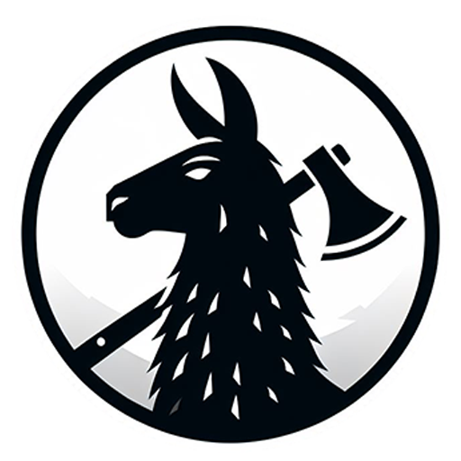

# llm-axe 

 

[](https://github.com/emirsahin1/llm-axe)

[](https://discord.gg/4DyMcRbK4G)


## Goal
llm-axe is meant to be a flexible toolkit that provides simple abstractions for commonly used functions related to LLMs. It's not meant to intrude in your development workflow as other larger frameworks often do.

It has functions for **automatic schema generation**, **pre-made agents** with self-tracking chat history and fully **customizable agents**.

[Have feedback/questions? Join the Discord](https://discord.gg/4DyMcRbK4G)

[Read the Development Documentation](https://github.com/emirsahin1/llm-axe/wiki)


## Installation - (Juan Updated)

### 1. Clone the Repository

```bash
git clone https://github.com/ntua-el20883/llm-axe
cd llm-axe
```

---

### 2. Install Ollama

Download and install the **Ollama** executable from:
[https://ollama.com/download](https://ollama.com/download)

Verify that Ollama is correctly installed and running:

```bash
ollama --version
```

---

### 3. Set Up Python Environment

In the root of the repository, create and activate a Python virtual environment:

```bash
python -m venv .env
# On Windows:
.env\Scripts\activate
# On macOS/Linux:
source .env/bin/activate
```

---

### 4. Install Dependencies

Install the `llm-axe` package:

```bash
pip install llm-axe
```

---

### 5. Download a Model

Browse available models in the [Ollama GitHub repository](https://github.com/ollama/ollama).
Pull your desired model locally. Example:

```bash
ollama pull llama3.2:3b
```

You can list all downloaded models:

```bash
ollama list
```

---

### 6. Test the Model (Optional)

To verify that the model runs correctly, open a separate terminal and start a chat session directly with Ollama:

```bash
ollama run llama3.2:3b
```

The model will maintain context across turns within the same session.

---

### 7. Integrate the Model with the Code

Open `./llm_axe/online_agent.py` in the project root and modify **line 5** to reference your chosen model:

```python
llm = OllamaChat(model="llama3.2:3b")
```

Replace `"llama3.2:3b"` with the name of the model you downloaded.

---

### 8. Run the Script

Execute the test script:

```bash
python ./llm_axe/va1_url_selector.py
```

You can now interact with the model through the script. Prompts can include URLs, which the model may process—it may take additional time depending on the complexity of the linked content.

---

### Notes

* Ensure Ollama is running before executing the Python script.
* Model performance and response time depend on system resources and model size.
* If you switch models, re-edit the model name in `./llm_axe/va1_url_selector.py` accordingly.


## Example Snippets
- **Streaming Support**:
```python
llm = OllamaChat(model="llama3.1")
ag = Agent(llm, custom_system_prompt="", stream=True)
res = ag.ask("Explain who you are in 20 paragraphs")

for chunk in res:
    print(chunk, end="", flush=True)
```

- **Easily Work With Non-Persistent Embeddings**:
```python
from llm_axe import read_pdf, find_most_relevant, split_into_chunks
text = read_pdf("./super_long_text.pdf")
sentences = split_into_chunks(text, 3)
pairs = []
for chunk in sentences:
    embeddings = client.embeddings(model='nomic-embed-text', prompt=chunk)["embedding"]
    pairs.append((chunk, embeddings))

prompt = "What do the Hobbit traditions say about second breakfast?"
prompt_embedding = client.embeddings(model='nomic-embed-text', prompt=prompt)["embedding"]
relevant_texts = find_most_relevant(pairs, prompt_embedding, top_k=4)
```  

- **Function Calling**

&emsp;&emsp;A function calling LLM can be created with just **3 lines of code**:
<br>
&emsp;&emsp;No need for premade schemas, templates, special prompts, or specialized functions.
```python
prompt = "I have 500 coins, I just got 200 more. How many do I have?"

llm = OllamaChat(model="llama3:instruct")
fc = FunctionCaller(llm, [get_time, get_date, get_location, add, multiply])
result = fc.get_function(prompt)
```

- **Custom Agent**
```python
llm = OllamaChat(model="llama3:instruct")
agent = Agent(llm, custom_system_prompt="Always respond with the word LLAMA, no matter what")
resp = agent.ask("What is the meaning of life?")
print(resp)

# Output
# LLAMA
```

- **Online Agent**
```python
prompt = "Tell me a bit about this website:  https://toscrape.com/?"
llm = OllamaChat(model="llama3:instruct")
searcher = OnlineAgent(llm)
resp = searcher.search(prompt)

#output: Based on information from the internet, it appears that https://toscrape.com/ is a website dedicated to web scraping.
# It provides a sandbox environment for beginners and developers to learn and validate their web scraping technologies...
```
- **PDF Reader**
```python
llm = OllamaChat(model="llama3:instruct")
files = ["../FileOne.pdf", "../FileTwo.pdf"]
agent = PdfReader(llm)
resp = agent.ask("Summarize these documents for me", files)
```

- **Data Extractor**
```python
llm = OllamaChat(model="llama3:instruct")
info = read_pdf("../Example.pdf")
de = DataExtractor(llm, reply_as_json=True)
resp = de.ask(info, ["name", "email", "phone", "address"])

#output: {'Name': 'Frodo Baggins', 'Email': 'frodo@gmail.com', 'Phone': '555-555-5555', 'Address': 'Bag-End, Hobbiton, The Shire'}
```
- **Object Detector**
```python
llm = OllamaChat(model="llava:7b")
detector = ObjectDetectorAgent(llm, llm)
resp = detector.detect(images=["../img2.jpg"], objects=["sheep", "chicken", "cat", "dog"])

#{
#  "objects": [
#    { "label": "Sheep", "location": "Field", "description": "White, black spots" },
#    { "label": "Dog", "location": "Barn", "description": "Brown, white spots" }
#  ]
#}

```

- **Product Discoverer (VA4)** - Automatic Green Loan Product Discovery
```python
from llm_axe.models import OllamaChat
from llm_axe.va4_product_discoverer import discover_and_extract_products

llm = OllamaChat(model="llama3.1:8b-instruct-q4_K_M")

# Automatically discover and extract energy efficiency loan products from Greek banks
products = discover_and_extract_products(
    bank_name="Eurobank",
    bank_url="https://www.eurobank.gr/el/retail/proionta-upiresies/proionta/daneia/prasina",
    llm=llm
)

# Results include structured data: product name, description, interest rate, eligible interventions, etc.
for product in products:
    print(f"Product: {product.get('programme_name')}")
    print(f"Rate: {product.get('interest_rate')}")
```

[**See more complete examples**](https://github.com/emirsahin1/llm-axe/tree/main/examples)

[**How to setup llm-axe with your own LLM**](https://github.com/emirsahin1/llm-axe/blob/main/examples/ex_llm_setup.py)


## Evaluation Workflow

The recommended flow is to run classification once, then generate QA responses as many times as needed from the stored classification outputs.

```bash
# 1) Run classification once and save *_classification.json files
python llm_axe/va4_product_discoverer.py

# 2) Generate QA responses from the stored classifications
python evaluation/qa_runner.py \
    --classification-dir output/va4_product_discoverer \
    --output-dir output/va4_product_discoverer \
    --questions-file evaluation/questions.json

# Optional: ask each question several times in one run for repeatability checks
python evaluation/qa_runner.py \
    --classification-dir output/va4_product_discoverer \
    --output-dir output/va4_product_discoverer \
    --questions-file evaluation/questions.json \
    --repeat-each-question 3

# 3) Validate saved QA answers against extracted structured fields
python evaluation/qa_consistency_validator.py \
    --classification-dir output/va4_product_discoverer \
    --qa-responses-dir output/va4_product_discoverer \
    --summary-only \
    --output output/evaluation/qa_consistency_report.json

# 4) Measure same-question repeatability across repeated QA runs
python evaluation/qa_repeatability_validator.py \
    --qa-responses-dir output/va4_product_discoverer \
    --summary-only \
    --output output/evaluation/qa_repeatability_report.json

# 5) Compute semantic similarity metrics from the consistency report
python evaluation/qa_semantic_validator.py \
    --qa-report output/evaluation/qa_consistency_report.json \
    --enable-bertscore \
    --summary-only

# 6) Flow F: generate visual analytics charts from all metrics
python evaluation/metrics_visualizer.py \
    --qa-consistency-report output/evaluation/qa_consistency_report.json \
    --qa-semantic-report output/evaluation/qa_semantic_report.json \
    --qa-repeatability-report output/evaluation/qa_repeatability_report.json \
    --html-report output/evaluation/html_json_report.json \
    --output-dir output/evaluation/plots
```

`qa_runner.py` writes timestamped `_qa_responses.json` files from the stored classification data, so you can repeat the QA step without rerunning classification. Use `--repeat-each-question` when you want multiple answers for the exact same question in one QA file.

`qa_repeatability_validator.py` compares answers for the same URL and question across repeated asks/runs. It reports pairwise Token-F1 and Jaccard similarity, which makes answer stability visible.

`metrics_visualizer.py` (Flow F) creates PNG charts and a `visual_summary.json` file for overall quality scores, per-program answer-data consistency, answer-source counts, semantic similarity, same-question repeatability, and HTML evidence found-vs-missing.

## Features

- Local LLM internet access with Online Agent
- PDF Document Reader Agent
- **Automatic Product Discovery & Extraction (VA4)** - Discover and evaluate financial products from trusted sources
- Premade utility Agents for common tasks
- Compatible with any LLM, local or externally hosted
- Built-in support for Ollama


## Important Notes

The results you get from the agents are highly dependent on the capability of your LLM. An inadequate LLM will not be able to provide results that are usable with llm-axe

**Testing in development was done using llama3 8b:instruct 4 bit quant**
